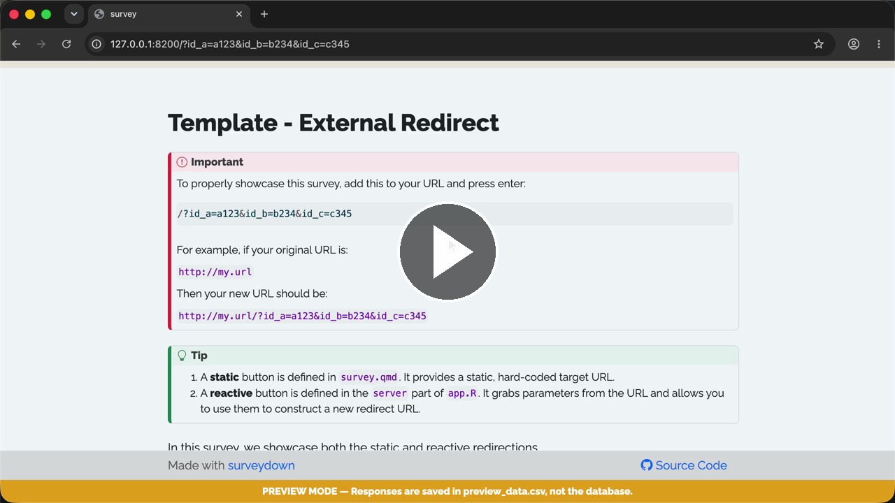

A reactive question template with redirectional links, accepting URL parameters.

### 🎬 Walkthrough Recording

[](https://cdn.jsdelivr.net/gh/surveydown-dev/template_external_redirect@main/video-recording.mp4)

*Click the image above to play the recording.*

### Template page

https://surveydown.org/templates/external_redirect

### Create this template

Run this command in your R console:

```r
surveydown::sd_create_survey(
  #path = "path/to/survey",
  template = "external_redirect"
)
```

### Documentation

[External redirect](https://surveydown.org/docs/external-redirect.html#reactive-redirect) · [Start with a template](https://surveydown.org/docs/getting-started#start-with-a-template)
